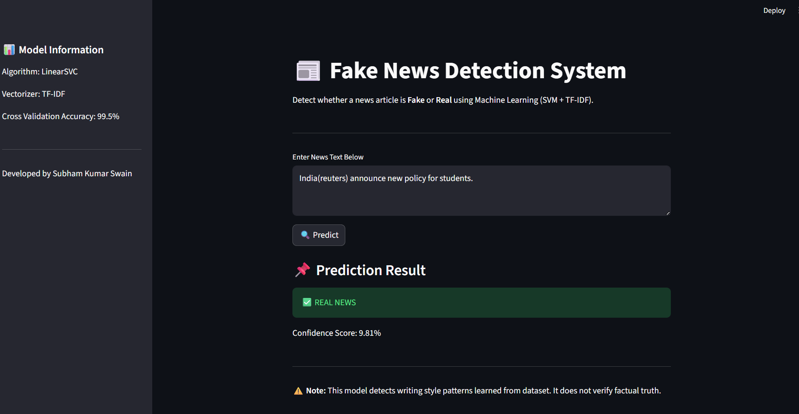
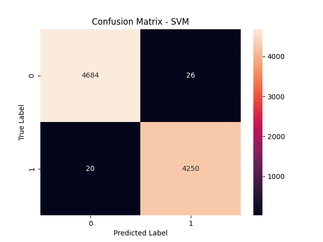

# 📰 Fake News Detection System

## Live App Preview



A Machine Learning based web application that detects whether a news article is **Fake** or **Real** using Natural Language Processing (NLP) techniques.

This project demonstrates end-to-end ML workflow including data preprocessing, model comparison, evaluation, and deployment using Streamlit.

---

## 🚀 Live Demo

https://fakenewsproject-qbs63o6klfypgxedj2gmry.streamlit.app/
---

## 📌 Project Overview

Fake news detection is a critical problem in today's digital world.  
This project uses **TF-IDF vectorization** and **Support Vector Machine (LinearSVC)** to classify news articles based on learned linguistic patterns.

The system was trained on a labeled dataset of real and fake news articles and deployed as a web application.

---

## 🧠 Machine Learning Pipeline

<<<<<<< HEAD
- Total Samples: **44,898**
- Columns: `text`, `label`
- Label:
  - `0` → Fake News
  - `1` → Real News

The dataset was preprocessed and combined into a single CSV file before training.
=======
1. Data Loading & Cleaning  
2. Text Preprocessing  
3. Train-Test Split  
4. TF-IDF Feature Extraction  
5. Model Training:
   - Multinomial Naive Bayes
   - Logistic Regression
   - LinearSVC (Best Performing Model)
6. Model Evaluation:
   - Accuracy
   - Precision
   - Recall
   - F1-Score
   - Confusion Matrix
   - Cross-Validation
7. Model Saving using Joblib  
8. Deployment using Streamlit  

---

## 📊 Model Performance

The **LinearSVC** model achieved strong performance with:

- High Accuracy (~99%)
- Balanced Precision and Recall
- Stable Cross-Validation scores
- Improved generalization using `class_weight='balanced'`

Cross-validation was used to ensure the model does not overfit and performs consistently across different data splits.

---

## 🛠️ Technologies Used

- Python
- Scikit-learn
- Pandas
- NumPy
- Matplotlib
- Joblib
- Streamlit

---

## 📂 Project Structure

```
fake_news_project/
│
├── models/
│   ├── fake_news_model.pkl
│   ├── tfidf.pkl
│
├── train_model.py
├── predict.py
├── app.py
├── requirements.txt
└── README.md
```

## 📊 Model Evaluation



---

## ▶️ How to Run the Project Locally

### 1️⃣ Clone the Repository

```bash
git clone https://github.com/subhamkumarswain/fake_news_project.git
cd fake_news_project
```

### 2️⃣ Install Dependencies

```bash
pip install -r requirements.txt
```

### 3️⃣ Train the Model (Optional)

```bash
python train_model.py
```

### 4️⃣ Run the Streamlit Web App

```bash
streamlit run app.py
```

The app will open in your browser at:

```
http://localhost:8501
```

---

## 💡 How It Works

- The input news text is converted into numerical features using TF-IDF.
- The trained LinearSVC model predicts whether the article is Fake or Real.
- The decision function score is used to estimate prediction confidence.
- The result is displayed through a clean web interface.

---

## ⚠️ Important Note

This model detects writing style and linguistic patterns learned from the dataset.  
It does **not verify factual correctness** using external knowledge sources.

Short or out-of-distribution text may lead to biased predictions due to dataset limitations.

---

## 🎯 Learning Outcomes

This project demonstrates:

- Practical understanding of NLP
- Feature engineering with TF-IDF
- Model comparison and evaluation
- Handling class imbalance
- Cross-validation techniques
- Model deployment with Streamlit
- Production-style ML workflow

---

## 🔮 Future Improvements

- Advanced preprocessing (stemming / lemmatization)
- Hyperparameter tuning
- Probability calibration
- Explainable AI integration
- Deep Learning models (LSTM / Transformer)
- Integration with real-time news APIs

---

## 👨‍💻 Author

**Subham Kumar Swain**  
B.Tech Student | Machine Learning Enthusiast  
Passionate about AI, NLP, and real-world problem solving.

---

⭐ If you found this project interesting, feel free to star the repository!