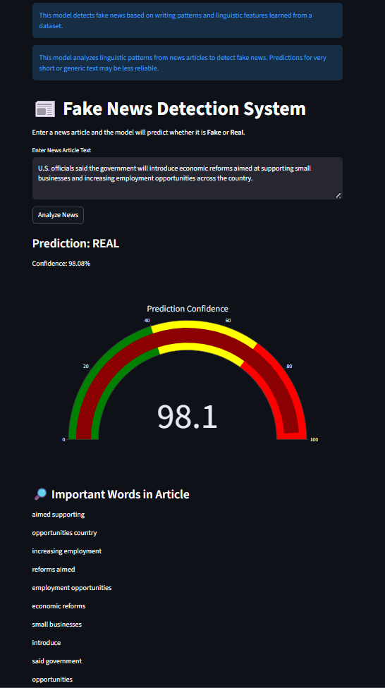
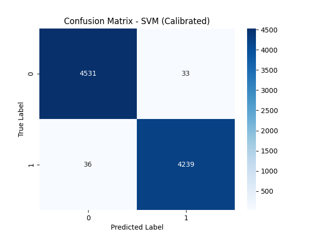
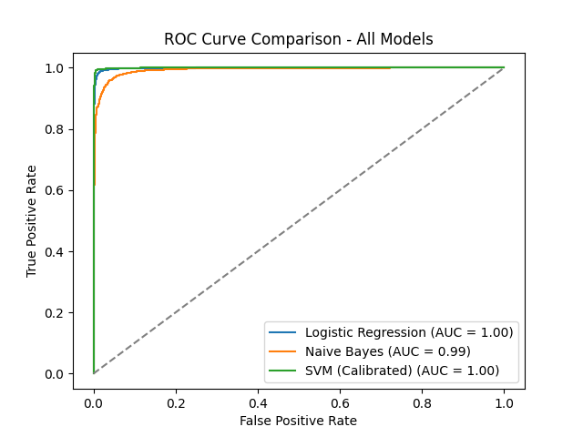

# 📰 Fake News Detection System (ML + Transformer)


## Live App Preview



A **Machine Learning + Deep Learning web application** that detects whether a news article is **Fake or Real** using **Natural Language Processing (NLP)** techniques.

This project demonstrates a **complete end-to-end ML pipeline** including:

- Data preprocessing
- Feature engineering
- Traditional machine learning
- Transformer-based deep learning
- Model comparison
- Web deployment using Streamlit

---

# 🚀 Live Demo

https://fakenewsproject-qbs63o6klfypgxedj2gmry.streamlit.app/

---

# 📌 Project Overview

Fake news is a major challenge in today's digital information ecosystem.

This project builds an **AI-powered fake news detection system** that classifies news articles as **Fake or Real** using two different approaches:

### 1️⃣ Baseline Machine Learning Model

Built using **Scikit-learn**

- TF-IDF feature extraction
- Support Vector Machine (SVM)

### 2️⃣ Transformer Deep Learning Model

Built using **DistilBERT (HuggingFace Transformers)**

This allows **comparison between traditional ML and modern NLP transformers**.

---

# 📊 Dataset Information

The dataset contains **real and fake news articles**.

### Dataset Statistics

Total samples: **44,898**

Columns:

| Column | Description |
|------|-------------|
| text | News article content |
| label | Classification label |

Label encoding:

```
0 → Fake News
1 → Real News
```

---

# 🧠 Machine Learning Pipeline

The project follows a structured ML workflow:

1. Data Loading
2. Data Cleaning
3. Train-Test Split
4. TF-IDF Feature Extraction
5. Model Training
6. Model Evaluation
7. Cross Validation
8. Model Saving
9. Web Deployment

---

# 🤖 Models Implemented

### Baseline Models

- Multinomial Naive Bayes
- Logistic Regression
- **LinearSVC (Best baseline model)**

### Transformer Model

DistilBERT fine-tuned for fake news classification.

Advantages:

- Context-aware predictions
- Better understanding of sentence structure
- Improved accuracy on complex text

---

# 📈 Model Comparison

| Model | Type | Strength |
|------|------|---------|
| LinearSVC | Traditional ML | Fast and efficient |
| DistilBERT | Transformer NLP | Context-aware predictions |

---

# 🧪 Example Prediction

Input:

```
Scientists have developed a new vaccine that shows promising results in clinical trials.
```

Output:

```
Prediction: REAL
Confidence: 86%
```

The system also highlights **important words influencing the prediction**.

---

# 🌐 Web Application

The application is built using **Streamlit**.

Features:

- Enter news article text
- Select prediction model
- View prediction confidence
- Interactive confidence gauge
- Important word visualization

---

# 📊 Model Evaluation

Evaluation metrics used:

- Accuracy
- Precision
- Recall
- F1 Score
- Confusion Matrix
- ROC Curve
- Cross Validation

---

# 📊 Model Evaluation Visualizations

### Confusion Matrix



### ROC Curve



---

# 🛠 Technologies Used

Programming Language:

- Python

Libraries:

- Scikit-learn
- PyTorch
- HuggingFace Transformers
- Streamlit
- Pandas
- NumPy
- Matplotlib
- Seaborn
- Plotly
- Joblib

---

# 📂 Project Structure

```
fake_news_project

│
├── models/
│   ├── svm_model.pkl
│   ├── vectorizer.pkl
│
├── distilbert_fake_news_model/
│
├── train_model.py
├── train_distilbert.py
├── predict.py
├── predict_distilbert.py
├── evaluate_distilbert.py
├── app.py
│
├── requirements.txt
├── README.md
│
├── App_Screenshot.png
├── CM_matrix.png
├── roc_curve.png
├── CM_distilbert.png
├── ROC_distilbert.png
```

---

# ▶️ How to Run the Project Locally

## 1️⃣ Clone Repository

```
git clone https://github.com/subhamkumarswain/fake_news_project.git

cd fake_news_project
```

---

## 2️⃣ Install Dependencies

```
pip install -r requirements.txt
```

---

## 3️⃣ Train the Models

Train baseline ML model:

```
python train_model.py
```

Train DistilBERT model:

```
python train_distilbert.py
```

---

## 4️⃣ Run Web Application

```
streamlit run app.py
```

Open in browser:

```
http://localhost:8501
```
## Model Files

Trained model files are not included in the repository due to GitHub file size limits.

To generate them locally run:

python train_model.py
python train_distilbert.py

---

# ⚠️ Important Note

This system detects **linguistic patterns learned from the dataset**.

It **does not verify factual correctness using external knowledge sources**.

Very short or unusual text may produce less reliable predictions.

---

# 🎯 Learning Outcomes

This project demonstrates:

- Natural Language Processing
- TF-IDF Feature Engineering
- Transformer-based NLP
- Model Comparison
- Cross Validation
- Model Deployment
- Building ML Web Applications

---

# 🔮 Future Improvements

Possible improvements:

- Explainable AI using SHAP / LIME
- Real-time news verification APIs
- Larger transformer models
- Multi-language fake news detection

---

# 👨‍💻 Author

**Subham Kumar Swain**

B.Tech Student | Machine Learning Enthusiast

Interested in AI, NLP, and real-world machine learning systems.

---

⭐ If you found this project useful, consider **starring the repository**.
